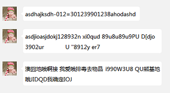
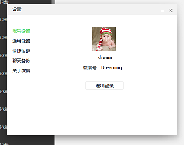
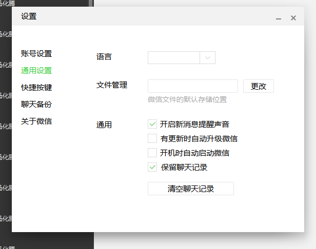

##采用Duilib开源框架开发PC端微信

###配置需求
* （包含库文件） E：\users\WeChat\DuiLib; (users:用户根据自己路径)
 
* （包含lib文件） E：\users\WeChat\Lib;    (users:用户根据自己路径)
 
* 如下图所示

    
    
###更新日记

* 2016-3-30 新增托盘消息提示窗口，改善窗口切换存在不顶置的问题

* 2016-3-29 新增聊天记录本地缓存，优化聊天界面 

* 2016-3-27 优化聊天界面（消息提示）

* 2016-3-25 优化气泡聊天字符居中自适应

    

* 2016-3-24 新增设置窗口  
    
    

###部分截图
* 
* 
* 
* 
* 
* 

###联系方式
* QQ：505273598
* Weibo: [MJH_Dream](https://weibo.com/u/2007921855/home?wvr=5)