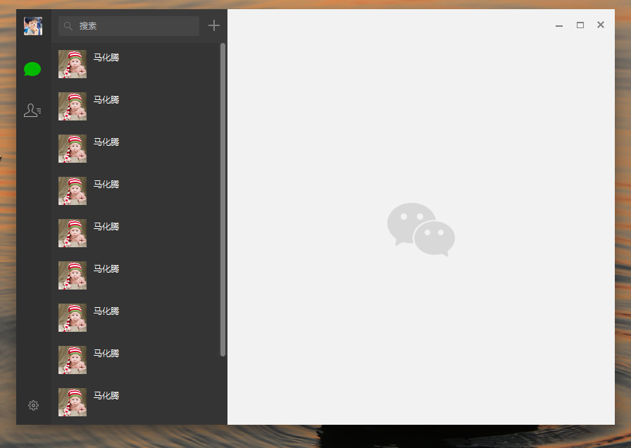
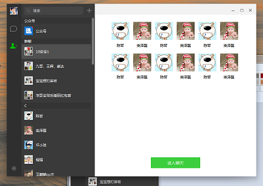

#采用Duilib开源框架开发PC端微信

##配置需求
### 1、（包含库文件） E：\users\WeChat\DuiLib; (users:用户根据自己路径)
### 2、（包含lib文件） E：\users\WeChat\Lib;    (users:用户根据自己路径)

##完成功能

###1、主界面

###2、气泡聊天

###3、通讯录

###4、群聊界面

###5、好友界面

###6、托盘

